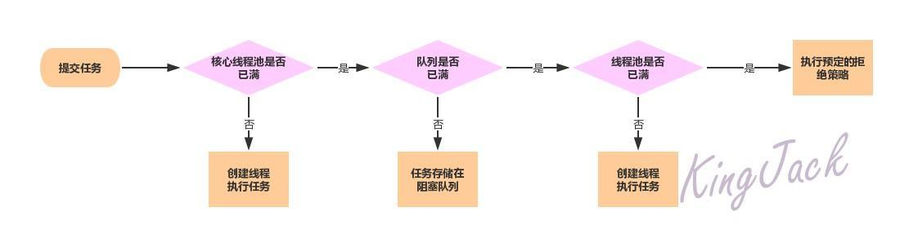
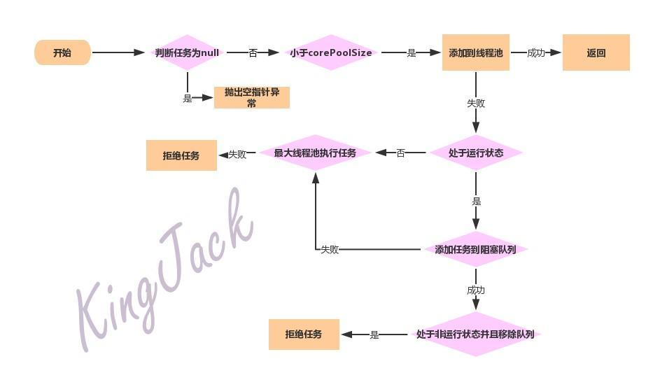

## 线程池源码学习



### ctl相关参数详解

```java
 private final AtomicInteger ctl = new AtomicInteger(ctlOf(RUNNING, 0));

     //用来表示线程池数量的位数，很明显是29，Integer.SIZE=32
     private static final int COUNT_BITS = Integer.SIZE - 3;
     //线程池最大数量，2^29 - 1=000 11111 11111111 11111111 11111111
     private static final int CAPACITY   = (1 << COUNT_BITS) - 1;
     //计算机底层是用补码表示的
     // runState is stored in the high-order bits
     //我们可以看出有5种runState状态，证明至少需要3位来表示runState状态
     //所以高三位就是表示runState了
     //可以接受新任务并且处理已经在阻塞队列的任务 高三位全是1
     private static final int RUNNING    = -1 << COUNT_BITS;
     //不接受新任务，但是处理已经在阻塞队列的任务 高三位全是0
     private static final int SHUTDOWN   =  0 << COUNT_BITS;
     //不接受新任务，也不处理阻塞队列里的任务，并且会中断正在处理的任务 高三位001
     private static final int STOP       =  1 << COUNT_BITS;
     //所有任务都被中止，workerCount是0，线程状态转化为TIDYING并且调用terminated()钩子方法 高三位是010
     private static final int TIDYING    =  2 << COUNT_BITS;
     //terminated()钩子方法已经完成所以高3位是110，就是TERMINATED状态
     private static final int TERMINATED =  3 << COUNT_BITS;

     // Packing and unpacking ctl
    /**
      传进来的c参数与取反的CAPACITY进行按位与操作
      1、低位29个0进行按位与，还是29个0
      2、高位3个1，既保持c参数的高3位
       既高位保持原样，低29位都是0，这也就获得了线程池的运行状态runState
    */
     private static int runStateOf(int c)     { return c & ~CAPACITY; }

    /**
       用入参c跟CAPACITY进行按位与操作
      1、低29位都是1，所以保留c的低29位，也就是有效线程数
      2、高3位都是0，所以c的高3位也是0
          
       这样获取出来的便是workerCount的值 
    */
     private static int workerCountOf(int c)  { return c & CAPACITY; }
    
     /**
       RUNNING是
        111 00000 00000000 00000000 00000000
                  
        ctlOf是将rs和wc进行按位或的操作
                  
        初始化的时候是将RUNNING和0进行按位或
        0的32位2进制是
        00000000 00000000 00000000 00000000

        所以初始化的ctl是
        111 00000 00000000 00000000 00000000
     */
     private static int ctlOf(int rs, int wc) { return rs | wc; }

     //用于存放线程任务的阻塞队列
     private final BlockingQueue<Runnable> workQueue;

     //重入锁
     private final ReentrantLock mainLock = new ReentrantLock();

     //线程池当中的线程集合，只有当拥有mainLock锁的时候，才可以进行访问
     private final HashSet<Worker> workers = new HashSet<Worker>();

     //等待条件支持终止
     private final Condition termination = mainLock.newCondition();

     //创建新线程的线程工厂
     private volatile ThreadFactory threadFactory;

     //饱和策略
     private volatile RejectedExecutionHandler handler;
```

```java
//Running 状态的高位全是1
-1 << COUNT_BITS

//这里是-1往左移29位，稍微有点不一样，-1的话需要我们自己算出补码来
          
//-1的原码
10000000 00000000 00000000 00000001
          
//-1的反码，负数的反码是将原码除符号位以外全部取反
11111111 11111111 11111111 11111110
          
//-1的补码，负数的补码就是将反码+1
11111111 11111111 11111111 11111111
          
//关键了，往左移29位，所以高3位全是1就是RUNNING状态
111 00000 00000000 00000000 00000000
```


### 创建线程参数详解

#### 1、corePoolSize(核心线程池大小)：

当提交一个任务到线程池时，线程池会创建一个线程来执行任务，即使其他空闲的基本线程能够执行新任务也会创建线程，当任务数大于核心线程数的时候就不会再创建。在这里要注意一点，线程池刚创建的时候，其中并没有创建任何线程，而是等任务来才去创建线程，除非调用了`prestartAllCoreThreads()`或者`prestartCoreThread()`方法 ，这样才会预先创建好`corePoolSize`个线程或者一个线程。

#### 2、maximumPoolSize(线程池最大线程数)

线程池允许创建的最大线程数，如果队列满了，并且已创建的线程数小于最大线程数，则线程池会再创建新的线程执行任务。值得注意的是，如果使用了无界队列，此参数就没有意义了。

### 3、keepAliveTime(线程活动保持时间)

此参数默认在线程数大于`corePoolSize`的情况下才会起作用， 当线程的空闲时间达到`keepAliveTime`的时候就会终止，直至线程数目小于`corePoolSize`。不过如果调用了`allowCoreThreadTimeOut`方法，则当线程数目小于`corePoolSize`的时候也会起作用.

### 4、unit(keelAliveTime的时间单位)

keelAliveTime的时间单位，一共有7种，在这里就不列举了。

### 5、workQueue(阻塞队列)

阻塞队列，用来存储等待执行的任务，这个参数也是非常重要的，在这里简单介绍一下几个阻塞队列。

ArrayBlockingQueue：这是一个基于数组结构的有界阻塞队列，此队列按照FIFO的原则对元素进行排序。

LinkedBlockingQueue：一个基于链表结构的阻塞队列，此队列按照FIFO排序元素，吞吐量通常要高于ArrayBlockingQueue。静态工厂方法`Executors.newFixedThreadPool()`就是使用了这个队列。

SynchronousQueue：一个不存储元素的阻塞队列。每个插入操作必须等到另一个线程调用移除操作，否则插入操作一直处于阻塞状态。吞吐量通常要高于LinkedBlockingQueue，静态工厂方法`Executors.newCachedThreadPool()`就使用了这个队列。

PriorityBlockingQueue：一个具有优先级的无阻塞队列。

### 6、handler(饱和策略)

当线程池和队列都满了，说明线程池已经处于饱和状态了，那么必须采取一种策略来处理还在提交过来的新任务。这个饱和策略默认情况下是`AbortPolicy`，表示无法处理新任务时抛出异常。共有四种饱和策略提供，当然我们也可以选择自己实现饱和策略。

- AbortPolicy：直接丢弃并且抛出`RejectedExecutionException`异常
- CallerRunsPolicy：只用调用者所在线程来运行任务。
- DiscardOldestPolicy：丢弃队列里最近的一个任务，并执行当前任务。
- DiscardPolicy：丢弃任务并且不抛出异常。

### 线程池核心方法

### 1、execute(Runnable command)方法



```java
 public void execute(Runnable command) {
        if (command == null)
            throw new NullPointerException();
        /*
         * 执行的流程实际上分为三步:
         *
         *1、如果运行的线程小于corePoolSize，以用户给定的Runable对象新开一个线程去执行
         *  并且执行addWorker方法会以原子性操作去检查runState和workerCount，以防止当返回false的
         *  时候添加了不应该添加的线程
         *
         *2、 如果任务能够成功添加到队列当中，我们仍需要对添加的线程进行双重检查，有可能添加的线程在前
         *  一次检查时已经死亡，又或者在进入该方法的时候线程池关闭了。所以我们需要复查状态，并有有必
         *  要的话需要在停止时回滚入列操作，或者在没有线程的时候新开一个线程
         *
         *3、如果任务无法入列，那我们需要尝试新增一个线程，如果新建线程失败了，我们就知道线程可能关闭了
         *  或者饱和了，就需要拒绝这个任务
         */
        int c = ctl.get();
        //如果运行线程数小于核心
        if (workerCountOf(c) < corePoolSize) {
            //往阻塞队列里添加线程
            if (addWorker(command, true))
                return;
            //失败再次获取控制状态
            c = ctl.get();
        }
         /*
          *判断线程池是否正处于RUNNING状态
          *是的话添加Runnable对象到workQueue队列当中
          */
            if (isRunning(c) && workQueue.offer(command)) {
            int recheck = ctl.get();
            //再次检查状态，如果状态<shotdown，将线程移出队列
            if (! isRunning(recheck) && remove(command))
                reject(command);
            //处于运行状态，工作线程等于0
            else if (workerCountOf(recheck) == 0)
                addWorker(null, false);
        }
      //尝试以最大线程数量添加线程
        else if (!addWorker(command, false))
            reject(command);
    }
```

1、首先判断任务是否为空，空则抛出空指针异常
2、不为空则获取线程池控制状态，判断小于corePoolSize，添加到worker集合当中执行，

- 如成功，则返回
- 失败的话再接着获取线程池控制状态，因为只有状态变了才会失败，所以重新获取
  3、判断线程池是否处于运行状态，是的话则添加command到阻塞队列，加入时也会再次获取状态并且检测
  ​ 状态是否不处于运行状态，不处于的话则将command从阻塞队列移除，并且拒绝任务
  4、如果线程池里没有了线程，则创建新的线程去执行获取阻塞队列的任务执行
  5、如果以上都没执行成功，则需要开启最大线程池里的线程来执行任务，失败的话就丢弃

### 2、addWorker(Runnable firstTask, boolean core)

```java
private boolean addWorker(Runnable firstTask, boolean core) {
        retry:
        for (;;) {
            int c = ctl.get();
            int rs = runStateOf(c);

            // Check if queue empty only if necessary.
            if (rs >= SHUTDOWN &&
                ! (rs == SHUTDOWN &&
                   firstTask == null &&
                   ! workQueue.isEmpty()))
                return false;

            for (;;) {
                int wc = workerCountOf(c);
                if (wc >= CAPACITY ||
                    wc >= (core ? corePoolSize : maximumPoolSize))
                    return false;
                if (compareAndIncrementWorkerCount(c))
                    break retry;
                c = ctl.get();  // Re-read ctl
                if (runStateOf(c) != rs)
                    continue retry;
                // else CAS failed due to workerCount change; retry inner loop
            }
        }

        boolean workerStarted = false;
        boolean workerAdded = false;
        Worker w = null;
        try {
            w = new Worker(firstTask);
            final Thread t = w.thread;
            if (t != null) {
                final ReentrantLock mainLock = this.mainLock;
                mainLock.lock();
                try {
                    // Recheck while holding lock.
                    // Back out on ThreadFactory failure or if
                    // shut down before lock acquired.
                    int rs = runStateOf(ctl.get());

                    if (rs < SHUTDOWN ||
                        (rs == SHUTDOWN && firstTask == null)) {
                        if (t.isAlive()) // precheck that t is startable
                            throw new IllegalThreadStateException();
                        workers.add(w);
                        int s = workers.size();
                        if (s > largestPoolSize)
                            largestPoolSize = s;
                        workerAdded = true;
                    }
                } finally {
                    mainLock.unlock();
                }
                if (workerAdded) {
                    t.start();
                    workerStarted = true;
                }
            }
        } finally {
            if (! workerStarted)
                addWorkerFailed(w);
        }
        return workerStarted;
    }
```

